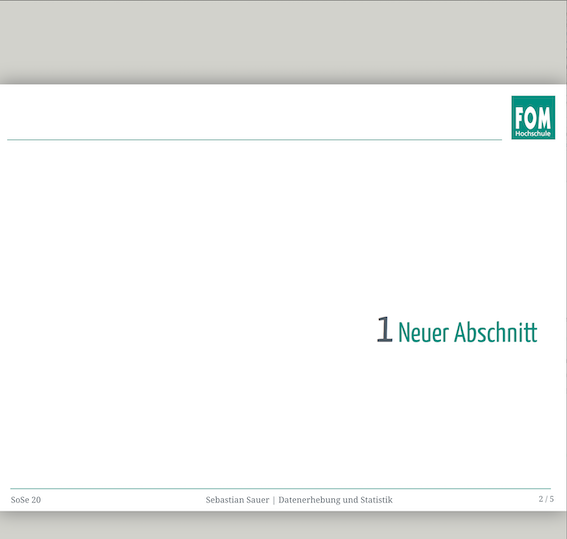

[](https://github.com/emersion/stability-badges#experimental)


Dieses Repositorium stellt eine Xaringan-Folienvorlage für die FOM (Fachhochschule für Oekonomie und Management) bereit. 

Mithilfe von [Xaringan](https://github.com/yihui/xaringan) kann man auf einfache Art und Weise [(R)Markdown]()-Folien erstellen; die Folien werden im HTML-Format erzeugt (PDF-Versionen sind möglich).

Eine Einführung in die Funktionalitäten von Xaringan findet sich [hier als Xaringan-Präsentation](https://slides.yihui.org/xaringan/#). Weitere Details finden sich auf der [Xaringan-Homepage](https://github.com/yihui/xaringan/wiki).

Dieses Repositorium stellt nur die FOM-Folienvorlage im Rahmen eines R-Paketes bereit. Alle übrigen zentralen Funktionalitäten werden von bestehender Software übernommen wie 

- [R](https://www.r-project.org/)
- [RMarkdown](https://rmarkdown.rstudio.com/) 
- [knitr](https://yihui.org/knitr/)
- [Xaringan](https://github.com/yihui/xaringan)


# Beispiele





# Installation

- Sie benötigen eine Internetverbindung.
- Installieren Sie R und RStudio. 
- Installieren Sie das R-Paket `devtools` (via CRAN).
- Installieren Sie das R-Paket `xaringan (via CRAN).
- Installieren Sie xafom so:

```r
devtools::install_github("https://github.com/sebastiansauer/xafom")
```


# Start

In RStudio klicken Sie auf *File > New File > RMarkdown ...*

Wählen Sie dann *From Template* und suchen Sie in der Lister nach *Slide template for xafom*.


# Probleme und Hilfe

Bitte stellen Sie Probleme, Ideen und Hilfegesuche [hier](https://github.com/sebastiansauer/xafom/issues) ein.


# Hinweise

- Sie müssen online sein, um die Folien in der HTML-Version zu erzeugen.
- Mit Google Chrome können Sie die Folien als PDF-Datei ausdrucken/konvertieren.


# Lizenz

Die Software von `xafom` ist nach MIT lizensiert. FOM-Logos etc. sind urheberrechtlich durh die FOM gGmbH geschützt. Siehe die Lizenzdatei für mehr Hinweise.


